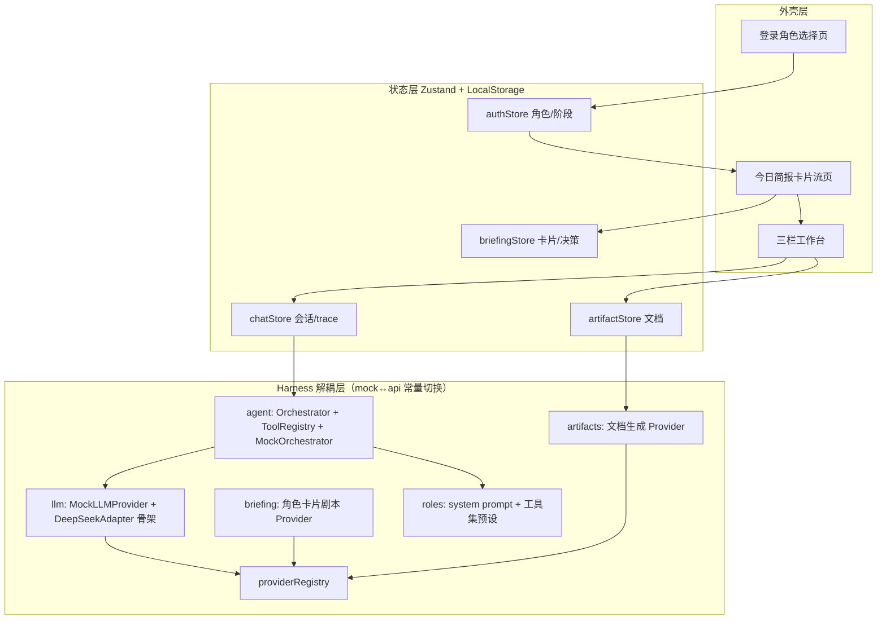

## 产品概述

EDUStudio —— 面向 K12 教育从业者（教育局 / 学校管理 / 教师）的轻量 AI Agent 工作台。卖点：通用 agent harness（Codex/CodeBuddy 类）太臃肿、成本高，本项目以 EduOS-95 的“解耦 Harness + Mock 兜底”模式 + DeepSeek 级低成本模型定位，构建开箱即用、离线可演示的教育工作台。

## 核心功能

- **角色登录**：登录页选择教育局 / 学校管理 / 教师三种身份，注入对应 system prompt、简报剧本与工具集
- **今日简报（卡片流首页）**：登录后进入卡片流，AI 主动推送洞察/决策/创作/待办/数据/提问六类卡片，支持 ←跳过、↑收藏、→采纳（键盘/触摸/鼠标拖拽），采纳后任务流入工作台
- **Chat+Artifact 工作台**：左侧任务/会话列表（含收藏夹），中间对话流（Agent 执行轨迹流式渲染），右侧 Artifact 预览与编辑（教案/报告/通知等教育文档）
- **Agent 编排内核**：Plan→Act→Reflect 循环，工具注册表（学情查询/校情统计/区域数据/政策检索/生成教案/命制试题/起草通知等 Mock 工具），Mock 剧本驱动 + 单步降级兜底
- **Mock 全流程**：本阶段不接真实 API，预制剧本 + 增量流式输出模拟真实模型体验；预留 DeepSeek OpenAI 兼容 adapter，切换 Mock↔API 零业务代码改动
- **数据分层持久化**：Raw→Aggregated→Agent Output→Presentation 四层组织，LocalStorage 持久化，离线开箱即用

## 交付约束

- 新建 Vite+React+TS 工程（工作区现仅 05-card-flow.html，其卡片数据模型与滑卡交互作为简报模块设计参考，不复用其样式代码）
- 参考项目为 CC BY-NC 协议，仅借鉴架构模式与目录规范，不复制代码

## 技术栈

- 构建：Vite 5 + React 18 + TypeScript 5
- 样式：Tailwind CSS 3（设计 token 集中在 theme 目录）
- 状态：Zustand 多 Store 分治（auth / briefing / chat / artifact / settings）
- 持久化：LocalStorage（命名空间前缀 `edustudio:`）
- Markdown：自研轻量渲染器（零依赖，符合轻量定位）
- 依赖最小化：无路由库（阶段状态机驱动 login→briefing→workbench），无 UI 框架重依赖

## 实现方案

1. **Harness 解耦层**（核心决策）：仿 EduOS-95 模式，每个域一个自包含 harness 子目录（types.ts / MockProvider.ts / adapter.ts / index.ts），统一由 providerRegistry 按 `ACTIVE='mock'|'api'` 常量切换；业务代码只依赖契约接口，后续接 DeepSeek（OpenAI 兼容 chat/completions SSE）时仅实现 adapter + 改一个常量
2. **Mock 流式体验**：MockLLMProvider 用异步生成器逐块产出文本（可变延迟模拟 token 流），支持 AbortController 取消；MockOrchestrator 按角色+场景走预制剧本，任何输入都有单步降级响应，保证演示零翻车
3. **Agent 执行可视化**：trace 事件流（Plan/Tool Call/Tool Result/Reflect/Done）驱动中栏流式渲染，工具结果可展开 JSON
4. **性能要点**：卡片堆叠只渲染 3 张；流式输出按块批量 setState 避免逐字符重渲；Zustand selector 细粒度订阅；长列表（会话/收藏）虚拟化预留
5. **合规**：不复制 EduOS-95 代码，仅复刻“自包含目录 + 注册函数 + 常量切换”模式

## 架构设计



## 目录结构

```
EDUStudio/
├── package.json / vite.config.ts / tsconfig.json / tailwind.config.js / postcss.config.js / index.html  # [NEW] 工程脚手架
├── src/
│   ├── main.tsx / App.tsx                        # [NEW] 入口与阶段分流（login/briefing/workbench）
│   ├── shell/
│   │   ├── LoginScreen.tsx                       # [NEW] 角色三卡选择登录
│   │   └── AppShell.tsx                          # [NEW] 工作台三栏外壳布局
│   ├── harness/                                  # [NEW] 解耦层（核心）
│   │   ├── types.ts                              # [NEW] LLMProvider/AgentProvider/BriefingCard/RolePreset 契约
│   │   ├── providerRegistry.ts                   # [NEW] 统一注册 + ACTIVE 常量切换
│   │   ├── llm/  (types/MockLLMProvider/adapter/index)      # [NEW] 流式 LLM 契约 + Mock + DeepSeek 骨架
│   │   ├── agent/ (types/Orchestrator/MockOrchestrator/ToolRegistry/tools/index) # [NEW] Plan→Act→Reflect 编排
│   │   ├── briefing/ (types/MockBriefingProvider/index)     # [NEW] 卡片流 Provider
│   │   ├── artifacts/ (types/MockArtifactProvider/index)    # [NEW] 教案/报告/通知生成 Provider
│   │   ├── roles/ (types/teacher/schoolAdmin/bureau/index)  # [NEW] 角色 system prompt + 工具集
│   │   └── scripts/                              # [NEW] 按角色+场景的预制剧本（含降级剧本）
│   ├── stores/ (authStore/briefingStore/chatStore/artifactStore/settingsStore) # [NEW] 状态与持久化
│   ├── apps/
│   │   ├── briefing/ (BriefingPage/CardDeck/DecisionBar)    # [NEW] 卡片流首页
│   │   ├── chat/ (ChatPanel/MessageList/AgentTrace/ChatInput) # [NEW] 对话流 + trace 渲染
│   │   └── artifacts/ (ArtifactPanel/MarkdownRenderer/Editor) # [NEW] 右栏文档预览编辑
│   ├── components/ (TypingStream/StatCard/Toast...)         # [NEW] 复用组件
│   ├── data/seed.ts                              # [NEW] Raw 种子数据（学校/班级/学情/区域指标）
│   ├── theme/tokens.css                          # [NEW] 设计 token
│   └── lib/ (stream/delay/storage/markdown)      # [NEW] 工具函数
```

## 关键契约

```ts
// harness/types.ts（核心契约，mock/api 双实现共同依赖）
export type ProviderMode = 'mock' | 'api';
export type RoleId = 'bureau' | 'schoolAdmin' | 'teacher';
export interface ChatMessage { role: 'system'|'user'|'assistant'|'tool'; content: string; toolCallId?: string }
export interface LLMProvider {
  streamChat(messages: ChatMessage[], signal?: AbortSignal): AsyncGenerator<string>;
}
export type AgentTraceEvent =
  | { kind: 'plan'; steps: string[] }
  | { kind: 'tool_call'; id: string; tool: string; args: Record<string, unknown> }
  | { kind: 'tool_result'; id: string; summary: string; payload?: unknown }
  | { kind: 'reflect'; text: string }
  | { kind: 'done'; text: string }
  | { kind: 'artifact'; artifactId: string };
export interface AgentProvider {
  runTask(input: { role: RoleId; goal: string; history: ChatMessage[] }, emit: (e: AgentTraceEvent) => void): Promise<void>;
}
export interface BriefingCard {
  id: string; role: RoleId;
  type: 'insight'|'decision'|'creation'|'todo'|'data'|'question';
  tag: string; title: string; body: string;
  extra?: 'chart'|'options'|'editable'|'todos'|'expandable';
  payload?: unknown; confidence: 1|2|3; source: string;
  action?: { kind: 'openTask'; goal: string };  // 采纳后注入工作台
}
```

## 设计风格

现代教育专业风工作台：纸感暖白底（延续 05-card-flow 的暖色调性）+ 靛蓝主色 + 珊瑚/琥珀/薄荷三色作为卡片类型与状态点缀。大量留白、大圆角卡片、柔和投影、微动效（卡片飞出、流式打字、trace 条渐入）。核心交互组件（卡片堆叠、Agent trace、文档编辑器）以 Tailwind 自研，shadcn 式设计语言用于弹层/提示等基础件。

## 页面规划（3 屏）

1. **登录页**：顶部品牌条（EDUStudio 标识 + Mock 模式徽标）；中部三张角色卡（教育局/学校管理/教师，含职责一句话与工具集预览 chips，hover 浮起）；底部版本说明。选中角色后渐变过渡进入简报。
2. **今日简报页**：顶部进度栏（日期+角色+已处理计数+进度条）；中央卡片堆叠舞台（仅渲染当前+下两张，六色卡型标签、置信度点、来源标注）；底部三决策圆钮（跳过/收藏/采纳）+ 键盘提示；采纳时卡片飞出并过渡至工作台。
3. **工作台**：左栏（新建任务按钮、会话/任务列表、收藏夹、角色徽标）；中栏（对话流：用户消息气泡、Agent trace 条——蓝 Plan/黄 Tool Call/绿 Result 可展开/白 Reflect/绿 Done、输入框+场景快捷 chips）；右栏（Artifact 面板：标题元数据、Markdown 预览/编辑切换、复制导出按钮，采纳的卡片任务自动在此流式生成文档）。
4. **设置弹层**：Mock/API 模式演示切换（API 态仅展示待接入说明）、清空本地数据。

## 响应式

桌面三栏优先；<1024px 右栏折叠为抽屉；<768px 简报卡片流保持完整触控体验，工作台转为单栏+底部导航。

## Agent Extensions

### Skill

- **playwright-cli**
- Purpose: 完成后自动化验证应用：启动 dev server 后打开页面，验证 登录→简报→采纳→工作台→Artifact 生成 全流程可走通、控制台无报错
- Expected outcome: 截图与流程验证报告，确认 Mock 流式渲染、滑卡决策、三栏工作台交互均正常