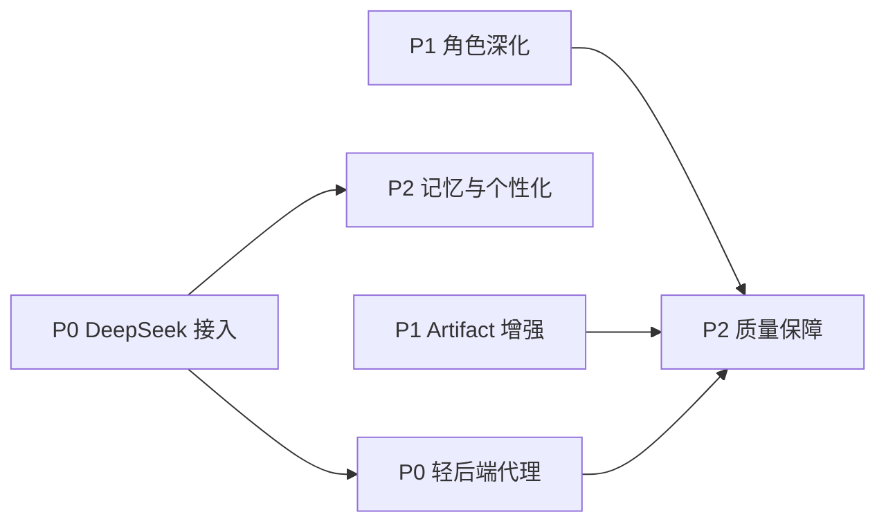

## 产品概述

为 EDUStudio（v0.1 已交付）制定下一迭代（v0.2）的开发计划文档，保存到新建的 `doc/` 文件夹。文档为中文、可直接指导开发：每项迭代包含背景与目标、现状与改动文件范围、技术方案、任务拆解、验收标准与风险。

## 核Features（文档覆盖的迭代方向）

- **P0 · DeepSeek 真实接入**：实现 DeepSeekAdapter.streamChat（OpenAI 兼容 SSE 解析）、Orchestrator function-calling 编排（Plan-JSON 降级）、设置页 key/model 配置与运行时切换
- **P0 · 轻后端代理**：Cloudflare Workers / Node 轻代理统一保管 key、限额与审计，避免浏览器暴露 key
- **P1 · 角色深化**：教师（试题编辑器/课件大纲）、学校管理（预警看板 recharts）、教育局（区域指标看板）
- **P1 · Artifact 增强**：Markdown/Word/PDF 导出、版本历史、模板库
- **P2 · 记忆与个性化**：用户偏好存储、常用场景自定义、偏好注入 system prompt
- **P2 · 质量保障**：harness 契约 Vitest 单测、关键流程 Playwright E2E

## 交付约束

- 仅新增 `doc/` 目录与 Markdown 文档，不改动任何 src 代码与构建配置
- 文档与 v0.1 代码现状严格对齐（引用真实文件路径与契约名，如 `src/harness/llm/adapter.ts` 的 `DeepSeekAdapter`、`providerRegistry.ts` 的 `ACTIVE_MODE`）
- 保持轻量定位：代理方案优先 Serverless 零运维，导出方案不引入重依赖

## 技术方案

- **产物形态**：纯 Markdown 文档（UTF-8、简体中文），新建 `doc/` 目录，共 8 个文件：1 个索引 + 1 个路线图总览 + 6 个专项方案
- **文档统一模板**：背景与目标 → 现状与改动文件 → 技术方案 → 任务拆解 → 验收标准 → 风险与对策；任务拆解标注优先级（P0/P1/P2）与依赖关系
- **与代码对齐的关键事实**（文档中引用）：
- `src/harness/llm/adapter.ts`：DeepSeekAdapter.streamChat 当前为抛错骨架，需实现 fetch + ReadableStream 的 SSE 解析（`data:` 行、`delta.content` 累积、`[DONE]` 终止、AbortSignal 贯穿）
- `src/harness/agent/Orchestrator.ts`：需实现 function-calling 循环（tools 组装、tool_calls 流式累积、工具回填、Plan-JSON 降级解析 `{steps:[{tool,args}]}`）
- `src/harness/providerRegistry.ts`：`ACTIVE_MODE` 为模块级常量，v0.2 需升级为 settingsStore 驱动的运行时切换（惰性获取 Provider）
- `src/stores/settingsStore.ts` + `src/components/SettingsDialog.tsx`：扩展 apiKey/baseUrl/model 配置项（key 仅存 LocalStorage，文档中标注安全边界）
- `src/stores/artifactStore.ts` / `src/apps/artifacts/ArtifactPanel.tsx`：导出与版本历史的挂载点
- `src/data/seed.ts`：看板所需时序数据需扩展（REGION_METRICS 增加历史序列）
- **路线图依赖关系**：

- **里程碑**：M1 = P0（打通真实模型）；M2 = P1（产品价值深化）；M3 = P2（个性化与质量护栏）
- **性能与复杂度**：文档任务无运行时开销；各方案文档需标注对 84KB gzip 包体的增量预算（如 recharts 按需引入、导出功能用 Blob/print 零依赖实现）