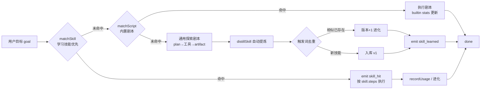

## 产品概述

EDUStudio v0.6 · 自进化技能系统版本。在 Harness 层引入 Hermes 式 Self-Evolving Skills：Agent 完成任务后自动复盘提炼经验为可复用技能，跨会话持久化，后续同类任务直接命中调用，并在使用中持续进化（版本递增、触发词扩充、使用统计）。配套提供可直观演示的一键演示向导与打磨后的 Mock 剧本；附带桌面工作台三栏拖拽调宽的 UI 优化。本版本独立完整交付（含文档、测试、版本号）。

## 核心功能

- **技能契约与技能库**：Skill（名称/触发词/步骤/来源 builtin|learned/版本/启停/使用统计/进化日志）；内置技能由现有剧本包装，学习技能自动沉淀；LocalStorage 持久化
- **三层执行链**：学习技能命中 → 内置剧本命中 → 通用探索执行（未命中时拆解目标、调用角色工具、产出文档），执行完自动提炼新技能入库
- **自动沉淀与进化**：任务完成后确定性提炼（无需人工确认）；相似技能去重合并为版本进化；用户可在技能库事后管理（启停/删除/编辑触发词）
- **API 模式接入**：命中技能注入 system prompt 提升输出；LLM 驱动提炼留接口骨架
- **可视化**：执行轨迹新增「命中技能 / 已沉淀技能」徽标；侧栏新增技能库面板（列表/详情/进化时间线）
- **一键演示向导**：分幕引导（技能发现→自动沉淀→复用命中→反馈进化），每幕预填输入+旁白讲解，支持一键/分步播放，可重置演示
- **三栏拖拽**：桌面工作台左/右栏宽度可拖拽调整（约束范围、双击重置、持久化），移动端抽屉不变

## 技术栈

沿用项目现有栈，零新依赖：Vite 5 + React 18 + TypeScript 5 + Tailwind CSS 3 + Zustand 5 + Vitest + Playwright。拖拽用原生 Pointer Events 实现，不引第三方库。

## 实现方案

### 1. Harness Skills 模块（新增 `src/harness/skills/`）

- `types.ts`：Skill 契约（复用 `ScriptStep` 作为技能步骤，与剧本体系同构）
- `library.ts`：内置技能注册（将 `AGENT_SCRIPTS` 12 个剧本包装为 builtin Skill，id 对齐剧本 id）+ `matchSkill(role, goal)` 检索（学习技能优先于内置，按触发词命中 + 使用次数排序，仅匹配 enabled 技能）
- `distill.ts`：确定性提炼 `distillSkill(goal, traceEvents)`——从 goal 提取触发词（去停用词、限长）、从 trace 提取 plan/tool/parallel 步骤序列；去重策略：与现有技能触发词重叠达阈值 → 合并触发词并版本+1（进化），否则新建 v1；导出 `SkillDistiller` 接口供 API 模式 LLM 实现接入（骨架 + TODO）
- `src/stores/skillStore.ts`：zustand + `lib/storage`（`edustudio:skills` 键）持久化；CRUD、recordUsage、evolve、clearLearned（重置演示用）；学习技能上限（如 50 条）防膨胀

### 2. 执行链集成

- `AgentTraceEvent` 扩展两个事件：`skill_hit`（命中技能：id/name/version/origin）与 `skill_learned`（沉淀/进化：id/name/version/evolved）
- `MockOrchestrator` 三层链：`matchSkill` 命中 → emit skill_hit → `runScript(skill.steps)` → recordUsage；未命中 → `matchScript` 内置剧本（同步 builtin stats）；仍未命中 → 新增「通用探索剧本」（plan 拆解 → 按角色默认工具 1-2 次调用 → reflect → artifact → done）→ `distillSkill` 自动入库 → emit skill_learned。降级引导文本保留为兜底
- `Orchestrator`（API 模式）：runTask 前 `matchSkill`，命中则将技能描述与步骤摘要追加进 system prompt，并 emit skill_hit；`SkillDistiller` LLM 实现留接口骨架
- `chatStore.handleEvent`：新增两类事件的 trace 入列分发

### 3. 技能库 UI 与演示向导

- `Sidebar` tab 扩展为 `tasks | fav | docs | skills`：技能卡片（名称 + vN 版本徽标 + 触发词 chips + 使用次数/成功率 + 来源徽标「内置/学习」）；详情展开含进化时间线、启停开关、删除（仅 learned）、触发词编辑、「清空学习技能」
- `AgentTraceView`：skill_hit 渲染 primary 色徽标（Sparkles 图标「命中技能 xxx · vN」），skill_learned 渲染 mint 色徽标（「已沉淀新技能 / 技能已进化至 vN」）
- `DemoWizard`（`src/apps/chat/`）：分幕剧本数据驱动（幕1 技能发现：预填未覆盖任务 → 通用执行 → 沉淀徽标；幕2 技能复用：预填同类任务 → skill_hit；幕3 技能进化：预填变化任务 → 版本+1）；每幕旁白卡 + 进度点，支持「一键播放」（自动逐步）与「分步播放」；入口在 ChatPanel 空状态与向导内「重置演示」；演示前自动清空学习技能保证可重复演示

### 4. 三栏拖拽

- `src/shell/Resizer.tsx`：Pointer Events 拖拽条（视觉 2px 线 + 约 8px 热区，hover/拖拽 primary 高亮，col-resize 光标，拖拽中禁选中文本）
- `AppShell`：左/右栏宽度改为受控 state（默认 320/400），clamp 约束（左 220–420、右 320–560），双击重置；`settingsStore` 扩展 `columnWidths` 持久化；仅 md+/xl+ 桌面生效，抽屉逻辑不变

### 性能与可靠性

- 技能匹配为内存线性扫描（技能量 ≤ 内置 12 + 学习 50），O(n·k) 关键词包含匹配，无性能瓶颈；提炼仅在任务完成时执行一次
- 持久化读写复用 `loadJSON/saveJSON`，带 try/catch 容错；提炼失败静默跳过不阻断任务完成
- 兼容性：`AgentTraceEvent` 为联合类型扩展，旧 trace 数据渲染不受影响；内置技能包装不改变现有剧本行为（未命中技能库时行为与 v0.5 一致）

## 架构设计



- 分层：契约（harness/skills/types + harness/types）→ 逻辑（library/distill 纯函数）→ 状态（skillStore）→ 编排（MockOrchestrator/Orchestrator）→ 呈现（Sidebar/AgentTraceView/DemoWizard）
- 遵循现有约束：业务只依赖 harness 契约；Mock ↔ API 切换零业务改动；任何输入都有响应

## 目录结构

```
src/harness/skills/
├── types.ts              # [NEW] Skill/SkillStats/SkillEvolution 契约
├── library.ts            # [NEW] 内置技能注册 + matchSkill 检索
├── distill.ts            # [NEW] 确定性提炼 + 去重/版本进化 + SkillDistiller 接口骨架
src/stores/skillStore.ts  # [NEW] 技能库 zustand 状态 + edustudio:skills 持久化
src/harness/types.ts      # [MODIFY] AgentTraceEvent 新增 skill_hit/skill_learned
src/harness/agent/MockOrchestrator.ts  # [MODIFY] 三层执行链 + 自动沉淀
src/harness/agent/Orchestrator.ts      # [MODIFY] API 技能注入 system prompt
src/harness/scripts/agent.ts           # [MODIFY] 通用探索剧本 + 剧本打磨
src/stores/chatStore.ts   # [MODIFY] handleEvent 新事件分发
src/stores/settingsStore.ts # [MODIFY] columnWidths 持久化
src/shell/Sidebar.tsx     # [MODIFY] skills tab + 技能列表/详情管理
src/shell/AppShell.tsx    # [MODIFY] 三栏受控宽度 + Resizer 接入
src/shell/Resizer.tsx     # [NEW] 拖拽分隔条组件
src/apps/chat/AgentTraceView.tsx # [MODIFY] 技能徽标渲染
src/apps/chat/ChatPanel.tsx      # [MODIFY] 空状态演示入口
src/apps/chat/DemoWizard.tsx     # [NEW] 分幕演示向导
src/__tests__/skills.test.ts     # [NEW] 匹配/提炼/去重/持久化用例
e2e/demo-wizard.spec.ts          # [NEW] 演示向导关键路径
doc/v0.6-roadmap.md              # [NEW] 路线图文档（沿用 v0.5 惯例）
README.md / package.json         # [MODIFY] 版本 0.6.0 + 特性记录
```

## 关键代码结构

```ts
/** 技能契约（harness/skills/types.ts） */
export interface Skill {
  id: string
  name: string
  description: string
  roles: RoleId[]
  triggers: string[]            // 关键词触发（小写包含匹配）
  steps: ScriptStep[]           // 复用剧本步骤体系
  origin: 'builtin' | 'learned'
  version: number
  enabled: boolean
  stats: { usageCount: number; successCount: number; lastUsedAt: number }
  evolution: { at: number; version: number; kind: 'created' | 'refined' | 'feedback'; note: string }[]
  createdAt: number
  updatedAt: number
}

/** AgentTraceEvent 新增（harness/types.ts） */
| { kind: 'skill_hit'; skillId: string; name: string; version: number; origin: 'builtin' | 'learned' }
| { kind: 'skill_learned'; skillId: string; name: string; version: number; evolved: boolean }
```

## 设计风格

沿用 EDUStudio 现有「纸感教育工作台」设计语言（暖白底 + 靛蓝主色 + 圆角卡片 + 柔和阴影），新增 UI 全部复用既有 token 与动效，不引入新视觉体系。

### 技能库面板（Sidebar 第 4 个 tab）

- 技能卡片：纸感圆角卡（rounded-xl border-line bg-surface），左侧 Sparkles 图标，名称 + `vN` 版本徽标；下方触发词 chips（primary-soft 底小圆角）；底部一行统计「使用 N 次 · 成功率 M%」+ 来源徽标（内置=灰描边、学习=mint 底）
- 详情展开：进化时间线（mint 色节点 + 相对时间 + 事件说明），启停开关、删除（仅学习技能，coral 危险色）、触发词编辑；面板底部「清空学习技能」次级按钮
- 空状态：引导文案「完成任务后，Agent 会自动沉淀技能」

### 执行轨迹技能徽标（AgentTraceView）

- skill_hit：primary-soft 底 + Sparkles 图标，「命中技能 xxx · vN」，样式与现有 Plan 卡同族但更轻量（单行条状）
- skill_learned：mint-soft 底 + CheckCircle2，「已沉淀新技能 xxx」/「技能已进化至 vN」，fade-up 入场

### 演示向导（DemoWizard）

- 底部浮动卡片（fixed bottom 居中，max-w-xl，shadow-pop 圆角 2xl）：顶部三枚进度点（当前幕 primary 高亮），幕标题 + 旁白讲解文字（ink-soft），主按钮「下一步 / 自动播放」（primary 实底）+ 次按钮「重置演示」；预填输入时输入框短暂 amber-soft 高亮提示
- 入口：ChatPanel 空状态新增「自进化演示」按钮（primary-soft 底 + Play 图标），与现有工具 chips 并列

### 三栏拖拽分隔条

- 视觉 2px 线（line 色），热区约 8px；hover/拖拽时变 primary 并加宽光标区，cursor col-resize；拖拽中 body 禁选中文本；双击重置默认宽度