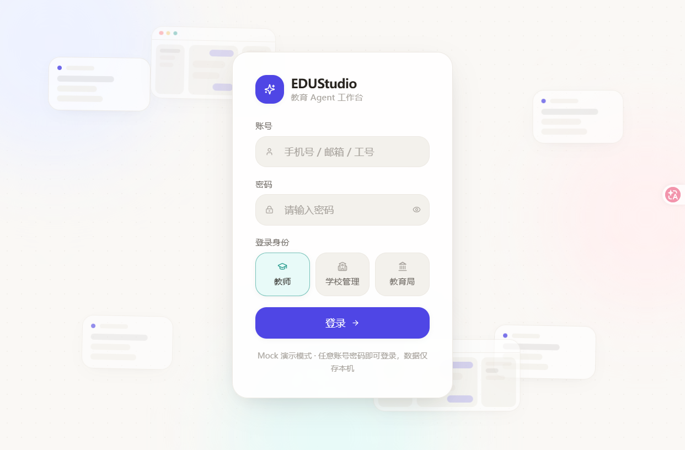
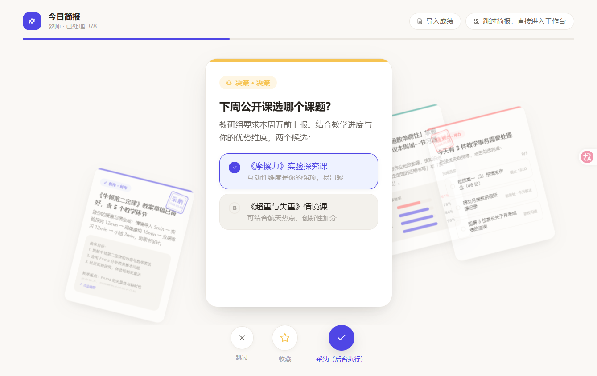
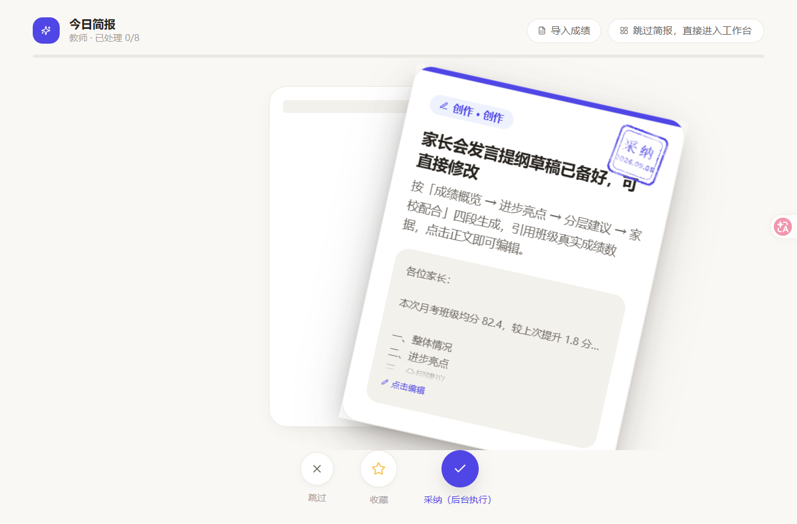
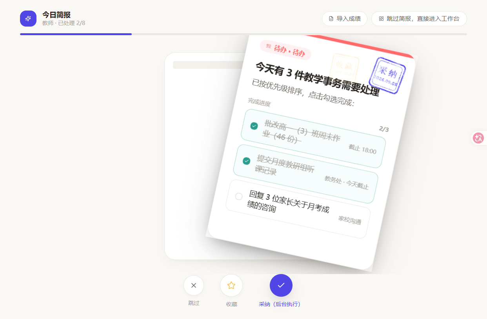
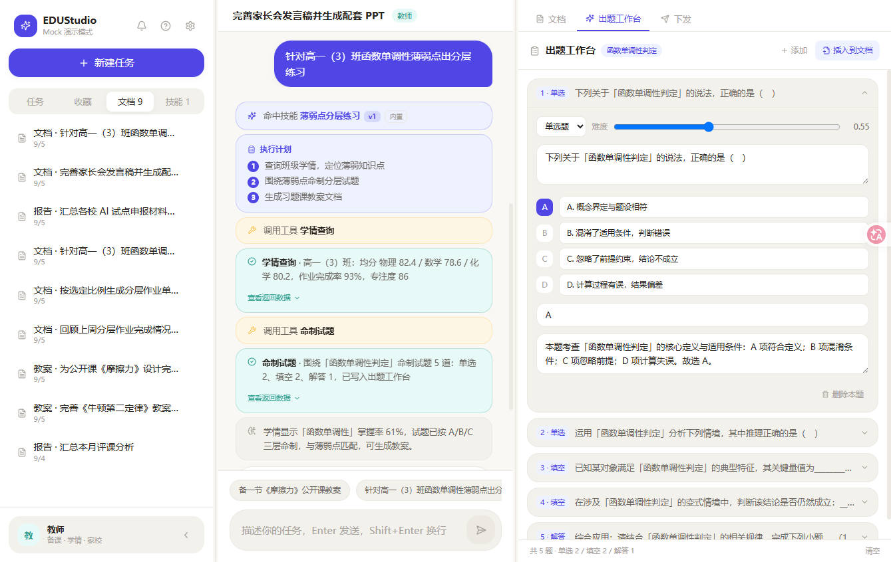
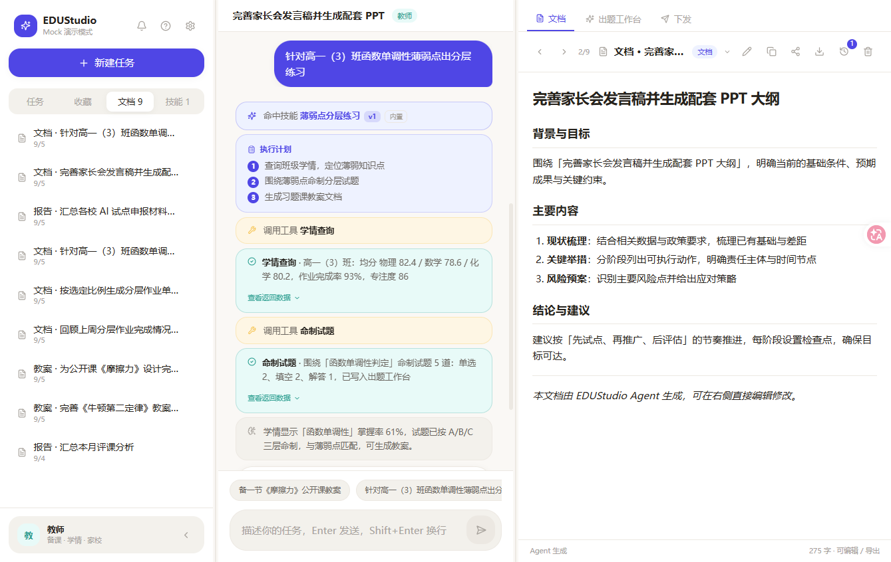
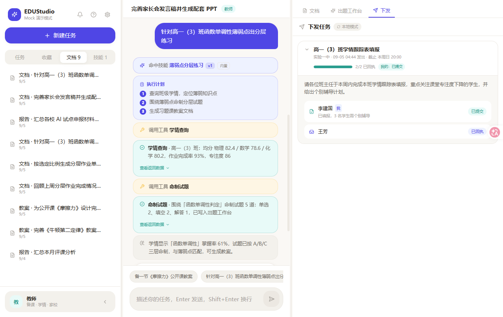

<div align="center">

# EDUStudio · Education Agent Workbench

**A lightweight AI Agent workbench for K-12 education practitioners (education bureaus / school admins / teachers)**

`v0.9.4` · `Loom Spatial Task Board · Briefing Tasks Laid Out · Drag-to-Arrange · Visible Dependencies · Human-in-the-Loop`

[](./LICENSE)
[](./package.json)
[](#-quality-assurance)
[](#-quality-assurance)
[](#-quality-assurance)
[](#-quality-assurance)

[中文文档](./README.md) | English

</div>

---

## Project Positioning

General-purpose Agent Harnesses (Codex / CodeBuddy style) are too heavy and costly for education practitioners.
EDUStudio adopts a **decoupled Harness + Mock fallback + DeepSeek-level low-cost model** approach to build
an out-of-the-box, offline demo-ready education workbench: **log in to review, approve to kick off, stamp to record**.

| Dimension | General Agent Harness | **EDUStudio** |
| --- | --- | --- |
| Deployment | Local runtime / server required | **Pure frontend SPA** (self-hostable) |
| Model cost | Locked to vendor | **Fully under your control**, model of your choice |
| Demo stability | Depends on network & keys | **Mock fallback**, offline demo-ready, zero failures |
| Education fit | Generic prompt engineering | **Three role scripts + data context layer + self-evolving skills** |
| Offline capability | Weak | **Works right after login, full LocalStorage persistence** |
| End-to-end UX | CLI / IDE | **Three-screen flow**: Login → Daily Briefing → Workbench |

---

## Three-Screen Flow

EDUStudio follows one underlying thread — **"receive → review → act"**: log in with an identity, swipe briefing cards and stamp decisions, then execute in the workbench.

| Stage | Form | Key Capabilities |
| --- | --- | --- |
| **Login** | Formal username/password page, background animation echoing "card briefing + workbench" | Three-role switching (Teacher / School Admin / Bureau), Mock ↔ API mode switch, 12–22px draggable global font scaling |
| **Daily Briefing** | Card-flow home with six card types (Insight / Decision / Creation / Todo / Data / Question) | Drag ← skip / ↑ favorite / → adopt, **real stamp animation** (double-line stamp face + SVG ink texture + slam-and-recoil), **v0.8.2 kept-card physics**, **v0.8.3 first-entry generation intro**, **v0.8.4 custom regeneration**, **v0.9 document import + weekly card-deck rotation** |
| **Workbench** | Three-column layout: Tasks / Conversation / Artifact | Agent execution trace (Plan → Tool Call → Result → Reflect → Done), skill-hit badges, in-house Markdown renderer |

<p align="center">
  
  <br/><em>Login page · username/password + role switching + Mock demo mode hint</em>
</p>

---

## v0.9.0 Features · Trust & Robustness

> Mainline release (8 milestones), shipped with v0.9.0.
> Status: ✅ Completed · Unit tests (181 cases, +34) + E2E (9 cases) + visual regression (clock-fixed dates) + bundle budget all green, zero new dependencies.

Moving the product from "demoable" to "trustworthy" — fixing wiring gaps in the Agent main path, adding a data safety net, and establishing accountability boundaries for AI decisions:

- **Function-calling wiring (M1)**: `tools` definitions are now sent with the request body (before v0.9 they never entered the request, so API-mode task goals fell back to Plan-JSON 100% of the time); tool_calls shard accumulation / parallel execution / failure-degradation chains now genuinely take effect;
- **Data safety net (M2)**: Settings → "Data Backup" — one JSON file rescues all local data (export with double confirmation / restore-overwrite confirmation / key whitelist for cross-version compatibility); a persistent notice states "all data is stored only in your local browser and never uploaded";
- **Decision accountability (M3)**: a persistent notice on the briefing page — "AI-generated content is for reference only; please review manually before adopting" — plus the same notice atop artifacts, with first-run onboarding setting expectations;
- **Mock boundary labeling (M4)**: global demo badge + session banner clearly stating "built-in scripts, not real AI";
- **Navigation & back key (M5)**: the browser back button no longer exits the site (pushState/popstate history integration), and mobile top bar gains an explicit "← Briefing" return entry;
- **Document import (M6)**: unified "Import Document" for all roles — .csv/.txt/.md raw text passes straight into LLM context as attached material (with purpose & instruction input, length-cap truncation, and review/delete for imported items); card decks rotate weekly for freshness;
- **Diagnostics polish (M7)**: connection error classification hints (offline/CORS, invalid key, wrong endpoint), E2E de-hardcoding, token budget copy noting "approximate, output only", key-storage wording review (obfuscated, not encrypted);
- **Quality & release (M8)**: +34 unit tests (tools request body / backup round-trip / error classification / attachment injection / weekly deck derivation), E2E clock fixed dates aligned with derived decks, bundle 266KB / 270KB gate passed.

> See [doc/v0.9-roadmap.md](./doc/v0.9-roadmap.md) for details.

---

## v0.8.4 Features · Briefing Custom Regeneration

> Small optimization (one item), shipped with v0.8.4.
> Status: ✅ Completed · Unit tests (157 cases, +8) + tsc verification passed, zero new dependencies.

The briefing top bar gains a "Regenerate" entry: a floating dialog expresses "what kind of briefing you want", and on confirm the deck reloads per current mode:

- **Prompt**: one-line customization (≤200 chars, API mode only), e.g. "Focus more on weak physics topics, pragmatic tone";
- **Card types**: multi-select among six types (Insight / Decision / Creation / Todo / Data / Question); none checked = no limit; Mock mode filters static scripts by type;
- **Reference material**: three toggles — real data context (role-named) / past decisions / favorited cards (API mode injects them as generation context);
- **Advanced options**: card count (3–10, default 5–7), content style (concise / detailed / data-oriented), interactive cards (charts / options / todos), generation params (timeout 6–30s, retries 1–3, all clamped);
- **Preference memory**: options persist in LocalStorage and refill on next open, surviving refresh / replay; on confirm, decisions clear and the intro animation replays; generation failure still falls back to "retry + Mock fallback".

> See [doc/v0.8-04-briefing-regenerate-dialog.md](./doc/v0.8-04-briefing-regenerate-dialog.md).

---

## v0.8.3 Features · Briefing Card-Generation Intro Animation

> Small optimization (one item), shipped with v0.8.3.
> Status: ✅ Completed · tsc verification passed, no new dependencies, pure transform/opacity animation.

For users who have already seen the onboarding guide, the **first briefing entry of each session** and the **replay after stamping** play an intro animation consistent with the "paper-and-ink review" design language, depicting **today's briefing cards being generated** (no text throughout):

- **Cards fly in and stack**: three cards fly in from the lower right one by one, settling with slight alternating tilts, geometrically aligned with the real deck's three-layer stack;
- **Landing sparkle**: each landing card bursts a halo at its top-right corner; the top card additionally bursts three-colored particles (indigo / green / amber);
- **"Generating" expression**: top-card starburst pulse + diagonal sheen sweeping repeatedly — keeps looping while API-mode deck generation is slow, without flashing a skeleton screen;
- **Seamless handoff**: once the deck is ready, the intro shrinks and fades out as a whole, and the real deck takes over with its existing entrance animation.

> Gating: normal entry plays at most once per session; "replay" always replays; first-time users still get the onboarding dialog on first entry (no stacking); skipped under `prefers-reduced-motion`.
> See [doc/v0.8-03-briefing-entry-intro.md](./doc/v0.8-03-briefing-entry-intro.md).

---

## v0.8.2 Features · Kept-Card Physics in Briefing

> Small optimization (one user-feedback item), shipped with v0.8.2.
> Status: ✅ Completed · Unit tests (149 cases, +2) + tsc verification passed, no new dependencies.

In the v0.7 card-swiping review experience, stamped cards **flew away and vanished** with the exit animation, causing two problems: reviewing lacked the ritual of "leaving a trace", and undoing mistakes was costly. v0.8.2 makes stamped cards **stay**:

- **Kept on stage**: after stamping, a card enters physics motion starting from "final drag position + fly-out offset", seamlessly continuing the v0.7 exit animation;
- **Physics motion**: a single rAF loop drives all kept cards — **no gravity, air drag only** (exponential decay of velocity / angular velocity) + elastic boundary bounce on all four edges (0.6);
- **Shrink & fade**: mid-flight, cards ease-out to 0.55× scale within 850ms and fade to 0.55 opacity within 320ms, then freeze;
- **Frozen stamps**: kept cards keep displaying their decision stamp (skip / favorite / adopt in three colors) — stamped state is obvious at a glance;
- **Drag back to re-review**: click or drag a kept card to take it back, **undo the decision** (favorites linkage removed, counts rolled back) and pin it as the current card; edit options / todos / body text and stamp again.

<p align="center">
  
  <br/><em>v0.8.2 kept-card physics · stamped cards shrunken, translucent and tilted beside the decision card</em>
</p>

> Compatibility: mobile (<768px) behaves exactly like v0.8.1 — the kept layer does not render; under `prefers-reduced-motion` the physics animation is skipped and cards are laid out directly along the stage's bottom edge by slot.
> See [doc/v0.8-02-briefing-kept-cards-physics.md](./doc/v0.8-02-briefing-kept-cards-physics.md).

---

## Daily Briefing · Card Flow

**"Briefing as workflow"**: swiping a card to make a decision is itself a structured task kickoff — adopted items auto-inject into the task goal, while skips and favorites land in todos and favorites.

| Capability | Description |
| --- | --- |
| Six card types | Insight / Decision / Creation / Todo / Data / Question, driven by structured prompts |
| Three decisions | ← skip, ↑ favorite, → adopt; keyboard / touch / drag interactions all consistent |
| **Interactive card content** | Options selectable, todos checkable, text editable, cards linkable; interaction state persisted in LocalStorage |
| **Real stamping** | Double-line stamp face + SVG ink texture + slam-and-recoil, **triggered only at the swipe-decision moment** |
| **Personalized ordering** | Mock scripts reorder by past decisions / favorites; API mode generates via LLM structured output (per-card runtime validation, timeout & failure fallback to Mock) |
| **Data-driven** | User prompt injects role-aggregated real data (teacher: class performance / school admin: school trends & alerts / bureau: regional metrics), with a hard "no fabrication" constraint |
| **Data source labeling** | Remote > CSV > static seed three-tier priority; remote failure auto-degrades and the UI labels "demo data"; refresh hinted after 7 days |
| **Focus mode** | Adoption moves to background execution + floating task indicator + a one-click summary layer after review (can be disabled in settings) |

<p align="center">
  
  <br/><em>Creation card "Polish the parent-meeting speech and generate the accompanying PPT" adopted · stamp animation frozen</em>
</p>

<p align="center">
  
  <br/><em>Todo card "3 teaching chores to handle today" skipped · stamp animation frozen</em>
</p>

---

## Workbench · Three-Column Layout

> Drag to resize columns; <1280px the right column folds into a drawer; <768px single column + bottom three-tab navigation (List / Chat / Docs).

| Column | Content | Key Capabilities |
| --- | --- | --- |
| **Left** | Tasks / Favorites / Docs / Skills tabs | One-click new task, favorites quick review, doc list with version indicator, skill library with hit badges |
| **Middle** | Conversation flow + Agent execution trace | Full Plan → Tool Call → Result → Reflect → Done orchestration; skill hits auto-tagged; approximate token hints |
| **Right** | Artifact preview & editing | In-house Markdown rendering, previous / next navigation (n/m position indicator), export with watermark |

### Agent Execution Trace & Skill Hits

<p align="center">
  
  <br/><em>Plan → performance query (class physics problem-solving rate 82.4 / numeric 78.6 / word problems 80.2, homework completion 93%, focus 86) → question authoring → skill hit "Weak-point Tiered Practice" v1</em>
</p>

### Artifact Document Editing (In-house Markdown Renderer)

<p align="center">
  
  <br/><em>Artifact document · "Polish the parent-meeting speech and generate the PPT outline" background & goals / main content / conclusions & suggestions</em>
</p>

### Task Assignment Panel (Task Chain + Receipts)

<p align="center">
  
  <br/><em>Assigned task "Grade 10 Class 3 performance tracking form" · due 9/5 · receipts 2/2 · with student names and status</em>
</p>

---

## Three Role Scripts

The role determines the system prompt, briefing scripts, and toolset — three data contexts.

| Role | Typical Briefing | Core Tools | Data Context |
| --- | --- | --- | --- |
| **Teacher** | Class performance, weak knowledge points, parent-meeting speeches, tiered practice | Performance query, question authoring, error attribution | Class scores (CSV import), homework completion rate, focus level |
| **School Admin** | School trends, supervision alerts, teacher support | Regional stats, trend comparison, alert rules | School-wide aggregation, cross-class comparison, cross-period comparison |
| **Bureau** | Regional metrics, school rankings, supervision notices | Regional summary, policy matching, notice templates | District metrics, two-semester decline detection, support scope targeting |

---

## Architecture · Decoupled Harness Layer

Business code depends only on the `harness/types` contract; Mock ↔ API switching requires zero business changes.

```
src/harness/
├── types.ts             # Core contracts (LLMProvider / AgentProvider / BriefingCard / RolePreset…)
├── providerRegistry.ts  # Unified registry, ACTIVE_MODE = 'mock' | 'api' one-switch flip
├── llm/                 # MockLLMProvider (streaming typewriter) + DeepSeekAdapter skeleton
├── agent/               # ToolRegistry + MockOrchestrator (Plan→Act→Reflect script-driven) + API skeleton
├── briefing/            # Daily briefing card provider
├── artifacts/           # Document generation provider (lesson plans / reports / notice templates)
├── roles/               # Three role presets (system prompt + toolsets)
├── sources/             # SourceProvider three-tier priority (CSV import > remote data platform > static seed)
└── scripts/             # Prebuilt scripts: briefing decks / Agent steps / doc templates (with fallback scripts)
```

| Step to a Real Model | Description |
| --- | --- |
| 1 | Implement `DeepSeekAdapter.streamChat` (OpenAI-compatible SSE) and `Orchestrator` (function-calling first, Plan-JSON fallback) |
| 2 | Flip `ACTIVE_MODE` in `providerRegistry.ts` to `'api'` |
| 3 | Every input gets a response: unmatched scripts fall through to role-based fallback scripts — zero demo failures |

---

## Self-Evolving Skill System (Hermes-style)

During execution the Agent **discovers → distills → stores → reuses → evolves** skills automatically, closing the self-evolution loop.

| Phase | Mechanism |
| --- | --- |
| Discovery | Trace summary → LLM retrospective → candidate skill |
| Storage | Trigger-word union, version +1, original steps preserved; LocalStorage persistence |
| Hit | API mode injects hit skills into the system prompt; Mock mode reserves the skeleton |
| Evolution | Dedup validation + version increment; auto-stored / evolved after task completion |
| Visualization | "Skill hit / skill stored" badges in the trace + sidebar skill library panel + one-click demo wizard completing the loop in three acts |

---

## Data Layering & Persistence

**Raw (`src/data/seed.ts` seed data) → Aggregated (tool aggregation) → Agent Output (trace / docs) → Presentation (rendering)**

| Layer | Description |
| --- | --- |
| Data sources | SourceProvider three-tier priority: **CSV import > remote data platform > static seed**; remote failure auto-degrades and the UI labels "demo data" |
| Data context | Role-aggregated real data → formatted into prompt text · source labeling + 1800-char truncation guardrail + single-source failure never blocks |
| Persistence | Sessions / favorites / docs / version history / preference profile / login state / learned skills all stored in LocalStorage (`edustudio:` prefix); settings dialog offers one-click clear |
| Teacher-specific | Class score CSV import on the briefing page (wide & long tables, fuzzy column matching + preview confirmation); the first briefing card is generated from real data |

---

## Real Stamp Animation (Swipe-Decision Moment Only)

- **Double-line stamp face**: skip (green) / favorite (gold) / adopt (purple), aligned with decision semantics;
- **SVG ink texture**: random ±15° rotation, irregular edges, randomized ink depth;
- **Slam-and-recoil**: after stamping, the card shrinks to 0.96 → springs back to 1.0, 280ms ease-out;
- **Kept-card stamps**: since v0.8.2, kept cards keep displaying their decision stamp — stamped state at a glance;
- **Reduced-motion respect**: under `prefers-reduced-motion`, physics / slam-recoil are skipped, keeping only stamp positioning.

---

## Responsive Design

| Breakpoint | Layout |
| --- | --- |
| ≥1280px | Desktop three columns (tasks / conversation / Artifact) |
| 768–1279px | Right column folds into a drawer |
| <768px | Single column + bottom three-tab navigation (List / Chat / Docs) + full briefing swipe touch experience (inertial snap-back) |

| Global Capability | Description |
| --- | --- |
| **Global font scaling** | 12–22px continuous drag adjustment that **applies globally** (root font-size scaling; sidebar / top bar / bottom nav all follow; ≥18px hides secondary info for senior users) |
| Login page | Formal username/password page, compact centered layout, background animation echoing the "card briefing + workbench" product form (floating cards + mouse parallax + click burst) |
| Mobile | Bottom nav includes iOS safe-area avoidance and input zoom prevention; since v0.8.1 the focus-mode background task indicator folds into the top bar on mobile, no longer covering cards or stamps |

---

## Quick Start

```bash
npm install
npm run dev      # Development (Vite auto-increments the port if taken)
npm run build    # Type check + production build (runs Vitest unit tests + tsc first)
npm run preview  # Preview the production build
npm test         # Vitest unit tests (367 cases)
npm run e2e      # Playwright critical-path E2E
npm run video:smoke   # Promo film frame smoke check (23 frames)
npm run video:frames  # Promo film full frame capture (1800 frames)
npm run video:bgm     # Synthesize BGM (needs Python + numpy)
npm run video:compose # Compose frames into mp4 (ffmpeg)
npm run video:mux     # Mux BGM into the final cut
```

---

## Deployment

### Frontend (Vercel, recommended)

Pure static SPA, **zero backend dependencies to go live** (`ACTIVE_MODE` defaults to `mock`, offline demo-ready):

1. Import this repo into Vercel (GitHub: `lzytttttt/EDUStudio`);
2. Framework: **Vite** (auto-detected), Build Command `npm run build`, Output Directory `dist`;
3. Alternatively run `vercel` at the repo root for one-click deploy; `vercel.json` ships with build params and SPA fallback rewrites.

> `npm run build` runs Vitest unit tests + `tsc` type checking first; any failure fails the build, forming a natural release quality gate.

### Lightweight Backend Proxy (Docker, optional)

Key hosting / rate limits / audit / share short links / task chains / error reporting — one command to bring up:

```bash
DEEPSEEK_KEY=sk-xxx docker compose up -d        # PowerShell: $env:DEEPSEEK_KEY='sk-xxx'; docker compose up -d
```

Frontend Settings → Mode "Proxy", endpoint `http://<host>:8787/v1`; audit logs and share / task-chain data persist in the `edustudio-data` volume.

---

## Tech Stack

| Category | Choice |
| --- | --- |
| Build | Vite 5 |
| View | React 18 · TypeScript 5 |
| Styling | Tailwind CSS 3 · tailwindcss-animate |
| State | Zustand |
| Icons | lucide-react |
| Charts | recharts |
| Unit tests | Vitest 2 |
| E2E | Playwright |
| Rendering | In-house Markdown renderer (zero dependencies) |

> No router library: a stage state machine `login → briefing → workbench`; the Markdown renderer is in-house with zero dependencies.

---

## Quality Assurance

| Gate | Description |
| --- | --- |
| **Vitest unit tests** | `npm test` runs Vitest (**378 cases**), covering SSE parsing / incremental normalization / Markdown rendering / tool registration / script & template matching / storage round-trip / preference injection / export utils / CSV score parsing / data-source fallback / context compression / skill distillation & retrieval / briefing card validation & personalized ordering / briefing interaction overlay & decision undo / background task pump / data context aggregation & truncation / LLM skill distillation validation & dedup evolution / briefing regeneration option injection & type filtering / decision-key guard matrix / date & seed freshness / doc visibility / Loom graph algorithms & canvas geometry / spatial task board store with idempotent tombstones / Loom runner topological execution & upstream injection / trace projection |
| **Build gate** | `npm run build` runs unit tests + tsc type checking first — a **double gate** for delivery quality |
| **Playwright E2E** | 7 critical paths + 2 self-evolution demos + 8 spatial task board (incl. dependency-chain execution and UX polish) |
| **Visual regression** | 4 baseline visual regressions (5% threshold, one-month observation period) |
| **Bundle budget gate** | main chunk 120KB / all JS 295KB gzip (`scripts/budget.mjs`); recalibrate per v0.6 / v0.8 / v0.8.4 / v0.9.3 precedent when exceeded; the Loom board is lazy-loaded so main chunk stays at 116.9KB |
| **Lighthouse CI** | Performance ≥ 0.85 (`lighthouserc.yml`) |

---

## Version History

| Version | Theme | One-liner |
| --- | --- | --- |
| **v0.9.4** | Loom spatial task board | Adopted briefing cards laid out on a canvas (one card one node + idempotent tombstones) + drag & connect to arrange (cycle rejection + undo/redo) + real topological execution over a single-flight gate (upstream output injected downstream + human-confirmation pause) + Agent Trace projected into the node and artifact-node navigation; zero new dependencies, board lazy-loaded |
| **v0.9.3** | Demo-presentation polish | Streamed documents into view (auto-switch to the Docs tab + generating badge + back-to-workbench hint) + arrow-key guard while editing (`shouldIgnoreDecisionKey`) + live briefing date & seed freshness + streaming render throttling & selector subscriptions; P1 demo pacing & first-entry; P2 engineering wrap-up |
| **v0.9.2** | Workbench UI polish · educator's view | Human-readable traces (display contract for 13 tools + "show tech details" toggle) + role-default right-panel tab + sidebar task cards (summary + relative time + always-visible delete) + center-column progress dashboard (step N/M · parallel N groups) + dispatch pending-receipt badge + briefing one-card-one-task (each adopted card gets its own task session) |
| **v0.9.1** | Layered memory & output self-eval loop | L2 episodic + L3 semantic preference local memory (ring buffer of 200 + role isolation) + preference injection for chat / briefing + rule-based doc self-eval (0-10 score + actionable advice) + harvesting loop for exports / feedback / card decisions |
| **v0.9.0** | Trust & robustness | Function-calling wiring (tools in request body) + data backup safety net (full export/restore + key whitelist) + decision accountability notices + Mock boundary labels + browser back-key history integration + document import (attachments straight to LLM + purpose instructions) + weekly deck derivation + connection error classification |
| **v0.8.4** | Briefing custom regeneration | Top-bar "Regenerate" dialog: prompt / six card types / reference toggles / advanced options (count 3–10 / style / payload / timeout-retry); API mode injects generation constraints, Mock filters scripts by type; options persist and refill |
| **v0.8.3** | Briefing card-generation intro | On first briefing entry and "replay": three cards fly in from the lower right and stack + landing sparkle + top-card generation sheen; shrink-fade handoff to the real deck; no text, skipped under reduced motion |
| **v0.8.2** | Briefing kept-card physics | Desktop stamped cards no longer vanish — fly-out initial velocity into physics motion + four-edge bounce + air drag + shrink-fade freeze, **drag back to re-review**; mobile unchanged |
| v0.8.1 | Focus mode mobile + multi-doc navigation | Background task indicator folds into the top bar on mobile + view background task details mid-review; right doc panel gains previous / next navigation + n/m position indicator |
| v0.8 | API-mode data-driven loop + LLM skill distillation | Data context layer (role aggregation + source labeling + truncation guardrail) + briefing API data-driven (real data injection + hard "no fabrication" constraint) + LLM skill distillation landed (trace → LLM retrospective → validation → dedup evolution) |
| v0.7 | Smart briefing | Mock script personalized ordering + LLM structured generation skeleton + interactive card content (options / todos / text / links) + **real stamp animation** (double-line face + ink texture + slam-recoil) + focus mode (background adoption + floating task indicator) |
| v0.6.1 | Login revamp + global font scaling + mobile | Username/password login page + mouse parallax / click burst + 12–22px drag global font scaling + mobile bottom-nav safe-area avoidance |
| v0.6 | Self-evolving skill system | Harness-layer Hermes-style Self-Evolving Skills: discover → store → hit → evolve; skill library panel + one-click demo wizard |
| v0.5 | Real data + deeper collaboration | SourceProvider data sources / CSV score import / share short links & annotation round-trip / task chain cross-device sync / notification center / context compression / visual regression & Lighthouse / Docker deploy |
| v0.4 | Share & collaborate + task kanban + e2e | Agent multi-turn loop + collaboration sharing + E2E/CI + performance tuning |
| v0.3 | Role deepening + Artifact enhancements | Question editor / alert kanban / regional metrics board + full-format doc export + version history + template library + memory & personalization + UI/UX polish |
| v0.2 | Real DeepSeek integration + lightweight proxy | SSE parsing + function-calling orchestration + Workers / Express dual solutions + rate limits & audit |
| v0.1 | Mock full-flow workbench | Login → Daily Briefing → three-column workbench |

---

## Next

- **v0.9.3 shipped**: demo-presentation polish (P0) — streamed documents brought into view, arrow-key guard while editing, demo date & data-freshness fixes, streaming render throttling — see [doc/v0.9.3-roadmap.md](./doc/v0.9.3-roadmap.md);
- **v0.9.3 shipped (cont.)**: P1 (wizard pacing / first-entry guides & demo fast-lane / asset consistency) and P2 (StrictMode dedupe / persist debounce / unused `react-icons` removal / promo-film one-command re-render) all shipped in this release;
- **Phase-2 candidates**: LLM-based preference distillation & self-eval (`getMemoryProvider` / `getEvaluator` already reserve mode switches), cloud memory sync (on the "won't do" list in the design doc, start on demand).

---

## License

This project is released under the [Creative Commons Attribution-NonCommercial 4.0 International (CC BY-NC 4.0)](./LICENSE) license.

- **Attribution (BY)**: you must give appropriate credit.
- **NonCommercial (NC)**: you may not use the material for commercial purposes.

See the [LICENSE](./LICENSE) file for details.
