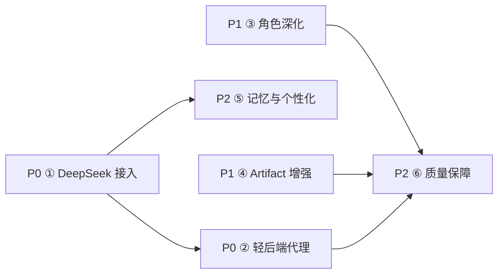

# EDUStudio v0.2 路线图

> 状态：规划中 ｜ 前置版本：v0.1（Mock 全流程工作台，已交付验证）
> 目标：从「离线可演示」走向「真实可用」——打通 DeepSeek 真实模型，同时保持轻量与低成本定位。

## 一、里程碑总览

| 里程碑 | 主题 | 包含专项 | 交付判据 |
| --- | --- | --- | --- |
| **M1 · 打通真实模型** | P0 | ① DeepSeek 接入 ② 轻后端代理 | 填入 key 后，对话/任务/文档生成全部走真实模型；无 key 时自动回退 Mock，演示零翻车 |
| **M2 · 产品价值深化** | P1 | ③ 角色深化 ④ Artifact 增强 | 三角色各有专属增强界面；教案/报告/通知可导出 Markdown/Word/PDF |
| **M3 · 个性化与质量护栏** | P2 | ⑤ 记忆与个性化 ⑥ 质量保障 | 偏好注入 system prompt；harness 契约单测 + 关键流程 E2E 进入 CI |

## 二、优先级与依赖图

- ① 是一切的前提：adapter 与 Orchestrator 实现后，Mock/API 双模式才真正可切换
- ② 依赖 ① 的接口形态（OpenAI 兼容 /v1/chat/completions），代理只是换 baseUrl
- ③④ 相互独立，可并行；⑤ 依赖 ①（偏好要注入真实 system prompt）
- ⑥ 收尾所有专项：契约单测先行（①③④ 都改 harness 层），E2E 覆盖关键流程

## 三、专项概览

### ① DeepSeek 真实接入（P0 → 详见 [v0.2-01-deepseek-adapter.md](./v0.2-01-deepseek-adapter.md))
实现 `DeepSeekAdapter.streamChat`（OpenAI 兼容 SSE 解析）与 `Orchestrator`（function-calling 优先、Plan-JSON 降级），
并把 `providerRegistry.ts` 的模块级 `ACTIVE_MODE` 常量升级为 settingsStore 驱动的运行时切换。
设置弹层扩展 apiKey / baseUrl / model 配置（key 仅存 LocalStorage，安全边界见专项文档）。

### ② 轻后端代理（P0 → 详见 [v0.2-02-proxy.md](./v0.2-02-proxy.md))
Cloudflare Workers（首选，零运维）与 Node/Express（备选，可自托管）双方案：
统一保管 key、按用户/IP 限额、请求审计日志；前端仅改 baseUrl 指向代理。

### ③ 角色深化（P1）
| 角色 | 增强点 | 主要改动 |
| --- | --- | --- |
| 教师 | 试题编辑器（题目/选项/答案/考点结构化编辑）、课件大纲生成 | 新增 `src/apps/teacher/`；`genQuiz` 工具返回结构化题目 |
| 学校管理 | 预警看板（recharts：趋势线 + 预警列表联动） | 新增 `src/apps/admin/`；`querySchoolStats` 增加时序数据 |
| 教育局 | 区域指标看板（recharts：多指标卡片 + 环比） | 新增 `src/apps/bureau/`；`src/data/seed.ts` 的 `REGION_METRICS` 增加历史序列 |

包体预算：recharts 按需引入（仅看板页 lazy import），增量 ≤ 40KB gzip。

### ④ Artifact 增强（P1）
- 导出：Markdown（Blob 下载，零依赖）、Word（html 转 doc 兼容格式，零依赖）、PDF（window.print + 打印样式）
- 版本历史：`artifactStore` 增加 `revisions: {content, savedAt}[]`，编辑保存时快照，上限 20 份
- 模板库：`src/harness/scripts/artifacts.ts` 模板暴露为可选起点（新建文档时选择）
- 挂载点：`src/apps/artifacts/ArtifactPanel.tsx` 工具栏、`src/stores/artifactStore.ts`

### ⑤ 记忆与个性化（P2）
- `src/stores/settingsStore.ts` 增加 `preferences`（称呼、学段、常用场景 chips 自定义）
- 偏好注入：`roles/index.ts` 的 systemPrompt 拼接函数 `buildSystemPrompt(preset, preferences)`
- 快捷指令：`src/apps/chat/ChatInput.tsx` 的 SCENES 改为可编辑（存 LocalStorage）

### ⑥ 质量保障（P2）
- 单测（Vitest）：`harness/types` 契约、`ToolRegistry`、`matchScript` 剧本匹配、`renderMarkdown`、SSE 解析器（mock 流）
- E2E（Playwright）：登录 → 简报采纳 → 工作台 trace → Artifact 生成 → 导出；Mock/API 双模式各跑一遍
- 进入 `npm run build` 前置检查：`vitest run && tsc -b`

## 四、包体与性能预算

| 项 | 当前 | v0.2 预算 | 措施 |
| --- | --- | --- | --- |
| JS（gzip） | 84KB | ≤ 150KB | recharts lazy import；导出零依赖；代理代码不进前端包 |
| 首屏 | 三屏状态机直渲染 | 不回退 | 看板页 `React.lazy` + Suspense |
| 流式渲染 | 打字机分块 | 不回退 | SSE 解析复用 typewriter 分块节奏，批量 setState |

## 五、风险总览

| 风险 | 影响 | 对策 |
| --- | --- | --- |
| 浏览器直连暴露 key | key 泄露 | M1 默认走代理；直连仅限本地开发并在设置页标注警示 |
| function-calling 模型行为不稳定 | 任务中断 | Plan-JSON 降级 + 单步兜底剧本（沿用 v0.1 模式） |
| SSE 在代理层被缓冲 | 流式变阻塞 | 代理禁用响应缓冲（Workers 天然流式；Express 关 compression） |
| 包体超预算 | 违背轻量定位 | 每专项验收含包体增量检查（`vite build` 产物对比） |
