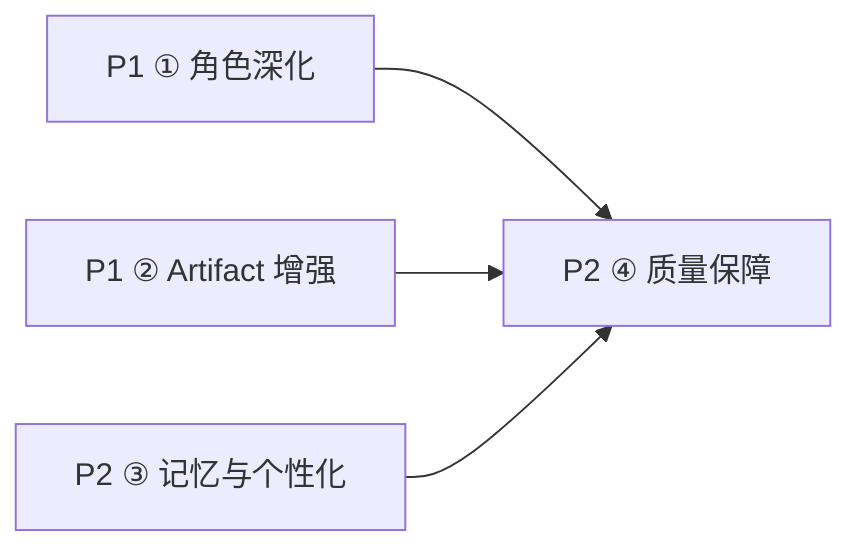

# EDUStudio v0.3 路线图

> 状态：规划中 ｜ 前置版本：v0.2（DeepSeek 真实接入 + 轻后端代理，已交付验证）
> 目标：从「真实可用」走向「好用」——三角色专属增强界面、文档全格式导出、个性化与质量护栏。

## 一、里程碑总览

| 里程碑 | 主题 | 包含专项 | 交付判据 |
| --- | --- | --- | --- |
| **M1 · 产品价值深化** | P1 | ① 角色深化 ② Artifact 增强 | 三角色各有专属增强界面；教案/报告/通知可导出 Markdown/Word/PDF |
| **M2 · 个性化与质量护栏** | P2 | ③ 记忆与个性化 ④ 质量保障 | 偏好注入 system prompt；harness 契约单测 + 关键流程 E2E 进入 CI |

## 二、优先级与依赖图

- ①② 相互独立可并行；③ 依赖 v0.2 已落地的 `buildSystemPrompt` 注入点（roles/index.ts）
- ④ 收尾所有专项：v0.2 新增的 SSE 解析器 / Orchestrator / parsePlanJson 均需契约单测

## 三、专项概览

### ① 角色深化（P1 → 详见 [v0.3-01-role-deepening.md](./v0.3-01-role-deepening.md))
| 角色 | 增强点 | 主要改动 |
| --- | --- | --- |
| 教师 | 试题编辑器（题目/选项/答案/考点结构化编辑）、课件大纲生成 | 新增 `src/apps/teacher/`；`genQuiz` 工具返回结构化题目 |
| 学校管理 | 预警看板（recharts：趋势线 + 预警列表联动） | 新增 `src/apps/admin/`；`querySchoolStats` 增加时序数据 |
| 教育局 | 区域指标看板（recharts：多指标卡片 + 环比） | 新增 `src/apps/bureau/`；`src/data/seed.ts` 的 `REGION_METRICS` 增加历史序列 |

包体预算：recharts 按需引入（仅看板页 lazy import），增量 ≤ 40KB gzip。

### ② Artifact 增强（P1 → 详见 [v0.3-02-artifact-enhancement.md](./v0.3-02-artifact-enhancement.md))
- 导出：Markdown（Blob 下载，零依赖）、Word（html 转 doc 兼容格式，零依赖）、PDF（window.print + 打印样式）
- 版本历史：`artifactStore` 增加 `revisions: {content, savedAt}[]`，编辑保存时快照，上限 20 份
- 模板库：`src/harness/scripts/artifacts.ts` 模板暴露为可选起点（新建文档时选择）
- 挂载点：`src/apps/artifacts/ArtifactPanel.tsx` 工具栏、`src/stores/artifactStore.ts`

### ③ 记忆与个性化（P2 → 详见 [v0.3-03-personalization.md](./v0.3-03-personalization.md))
- `src/stores/settingsStore.ts` 增加 `preferences`（称呼、学段、常用场景 chips 自定义）
- 偏好注入：`roles/index.ts` 的 systemPrompt 拼接函数 `buildSystemPrompt(preset, preferences)`
- 快捷指令：`src/apps/chat/ChatInput.tsx` 的 SCENES 改为可编辑（存 LocalStorage）

### ④ 质量保障（P2 → 详见 [v0.3-04-quality.md](./v0.3-04-quality.md))
- 单测（Vitest）：`harness/types` 契约、`ToolRegistry`、`matchScript` 剧本匹配、`renderMarkdown`、SSE 解析器（mock 流）、`parsePlanJson` 容错
- E2E（Playwright）：登录 → 简报采纳 → 工作台 trace → Artifact 生成 → 导出；Mock/API 双模式各跑一遍
- 进入 `npm run build` 前置检查：`vitest run && tsc -b`

## 四、包体与性能预算

| 项 | 当前（v0.2 后） | v0.3 预算 | 措施 |
| --- | --- | --- | --- |
| JS（gzip） | ~92KB | ≤ 140KB | recharts lazy import；导出零依赖 |
| 首屏 | 三屏状态机直渲染 | 不回退 | 看板页 `React.lazy` + Suspense |
| 流式渲染 | 打字机分块 | 不回退 | 看板/编辑器不阻塞 chat 流式队列 |

## 五、风险总览

| 风险 | 影响 | 对策 |
| --- | --- | --- |
| recharts 拉高包体 | 违背轻量定位 | 仅看板页 lazy import；验收含 `vite build` 产物对比 |
| 结构化试题与 LLM 输出格式不匹配 | 编辑器空转 | genQuiz 返回 JSON Schema 约定结构 + 解析失败回退纯文本 |
| Word/PDF 导出样式偏差 | 用户体验 | Word 用 doc 兼容 HTML；PDF 走打印样式（@media print） |
| E2E 依赖真实 API 不稳定 | CI 抖动 | E2E 默认 Mock 模式；API 模式作为手动验收项 |
