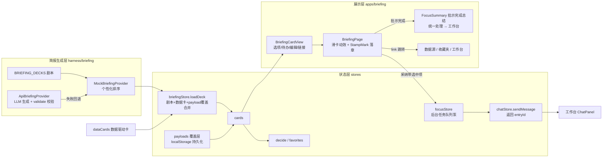

## 用户需求

本次 v0.7 迭代围绕「今日简报」完成五项升级（前三项为原始需求，后两项为追加需求）：

1. **简报生成增强**：既扩充 Mock 剧本与数据驱动逻辑（按角色、历史决策、收藏个性化生成），又搭好 API 生成骨架（LLM 结构化生成 + 运行时校验 + 失败回退 Mock），便于后续接入真实模型。
2. **简报内容可交互**：选项卡可选（选中后影响后续，采纳时带上选择结果）、待办可勾选（状态持久化）、文本可编辑（真正编辑并保存）、卡片可跳转（打开数据源、工作台任务、收藏夹）。
3. **盖章动效**：真实落章效果——印章旋转砸下 + 弹性回震 + 印泥纹理/边缘不均匀，接近真实盖章；仅应用在滑卡决策（跳过/收藏/采纳）瞬间。
4. **卡片动效优化**：滑卡手感升级——卡片随拖拽方向倾斜、拿起时轻微放大且阴影加深、堆叠卡片视差联动（后卡跟随前卡拖拽微位移/缩放）、决策飞出后后续卡片平滑补位、入场依次浮现。
5. **专注模式**：采纳简报后不再立即跳转工作台，任务转入后台执行并有动效提示（浮动任务指示器：计数 + 执行中脉冲，采纳瞬间指示器弹跳递增）；待全部卡片批示完成（跳过/收藏/采纳均算批示）后，展示「批示完成」总结层（已采纳任务清单 + 后台执行状态：执行中/已完成/失败），一键「统一处理」进入工作台。专注模式默认开启，设置中可关闭，关闭时回退原行为（采纳即跳工作台）。

## 产品概述

「今日简报」是登录后的第一个舞台：用户以滑卡方式消费结构化简报卡片并做出跳过/收藏/采纳决策。v0.7 让简报从"静态只读卡片"升级为"可交互、可个性化、可由 LLM 生成的智能简报"，并以真实落章动效、顺滑的卡片动效与专注模式强化决策的仪式感与沉浸感。

## 核心功能

- 个性化简报生成：剧本库扩充、历史决策/收藏驱动的个性化排序、CSV/远端数据卡驱动
- API 生成骨架：LLM 按角色与上下文生成结构化卡片、逐卡校验、失败回退 Mock
- 卡片内容交互：选项选择、待办勾选、文本编辑、跳转链接，交互状态持久化
- 采纳联动：采纳带选项的卡片时，选中项自动注入工作台任务目标
- 真实落章动效：双线印面 + 印泥纹理 + 砸下回震动画，仅出现在滑卡决策瞬间
- 卡片动效：拖拽倾斜/缩放/阴影反馈、堆叠视差联动、补位与入场动画
- 专注模式：后台执行指示器、批示完成总结层、统一处理入口

## Tech Stack

- **框架**：React 18 + TypeScript + Vite（现有项目栈，不引入新框架）
- **状态管理**：zustand 5（现有 briefingStore/settingsStore/chatStore 模式）
- **样式与动画**：Tailwind CSS 3.4 + tailwindcss-animate；动画全部走 tailwind keyframes + 内联 transform（项目无 framer-motion，且 scripts/budget.mjs 有 250KB gzip 包体门禁，**不引入 framer-motion**）
- **印章纹理**：内联 SVG filter（feTurbulence + feDisplacementMap）实现印泥边缘毛糙，径向渐变叠加模拟印泥浓淡不均
- **LLM 接入**：复用现有 DeepSeekConfig / providerRegistry 契约，参考 `ArtifactApiAdapter`（src/harness/artifacts/adapter.ts）的 api 模式实现
- **测试**：vitest（package.json 已有 `test`/`build` 脚本，目前无单测文件，本次新增首批单测）+ Playwright e2e

## Implementation Approach

### 模块一：简报生成增强

1. **类型扩展**（`src/harness/types.ts`）：`OptionsPayload` 增加 `selected?: number`；`BriefingCard` 增加 `link?: CardLink`（跳转链接，与现有 `action` 的"采纳"语义分离）；新增 `BriefingGenContext`（历史决策 + 收藏，决策联合类型在 types.ts 内联定义，避免 harness 反向依赖 stores）；`BriefingProvider.getDeck(role, ctx?)` 签名向后兼容（ctx 可选，现有调用点零破坏）。
2. **Mock 个性化**（`MockBriefingProvider.ts`）：接收 ctx，实现稳定排序——被跳过 ≥2 次的 tag 沉底、收藏过的 tag 关联卡前置，同序按原索引保持稳定避免闪烁。
3. **剧本扩充**（`scripts/briefing.ts`）：每角色扩充 2-3 张卡片，覆盖可选 options、todos、editable、link 示例，id 不与 `dc-` 前缀冲突。
4. **API Provider 骨架**（新建 `ApiBriefingProvider.ts` + `validate.ts`）：api 模式下组装角色 prompt + 上下文调用 LLM，要求输出结构化 JSON 卡片数组；`validateBriefingCard` 逐卡运行时校验（字段缺失/类型不符丢弃，不整体失败）；网络失败/超时（约 12s，AbortSignal + 计时器）/校验后为空时回退 `MockBriefingProvider`；`getBriefingProvider(mode, config?)` 对齐 `getArtifactProvider` 签名，providerRegistry 传入 config。

### 模块二：简报内容可交互性

1. **状态层**（`briefingStore.ts`）：新增 `payloads: Record<cardId, PayloadPatch>` 覆盖层并持久化（复用 `'briefing'` key，扩展 PersistedBriefing）；新增 `selectOption / toggleTodo / editCardText` 三个 action（同时更新覆盖层与 cards 数组保证即时响应）；`loadDeck` 时按 kind 判别合并覆盖层（只合并匹配 kind 的 patch，不破坏 chart 等只读 payload）。
2. **视图层**（`BriefingCardView.tsx`）：BriefingCardView 仅被 BriefingPage 使用（已确认），新增可选交互回调 props（缺省 no-op 保持兼容）；选项卡可点击（选中态靛蓝描边+对勾）；待办真实 checkbox（勾选划线置灰 + 头部进度 n/m）；editable 点击进入 textarea 编辑、失焦保存；卡片底部渲染 link（图标+label）；所有交互元素 `onPointerDown` 阻止冒泡，避免与滑卡拖拽抢占指针（容器已有 onClickCapture 拖拽后拦截，二者配合）。
3. **页面接线**（`BriefingPage.tsx`）：采纳时若卡片有选中选项，goal 追加"（已选：X）"；新增 `handleLink` 分发——source → 打开 CsvImportDialog（无导入权限角色回退为刷新数据）、task → 进入工作台、favorite → uiStore 定位侧栏收藏 tab 后进入工作台。

### 模块三：盖章动效

1. **印章组件**（新建 `StampMark.tsx`）：双线印面（外框 3px + 内框 1px）、印泥三色（跳过=coral、收藏=amber、采纳=primary）、SVG feTurbulence 位移滤镜制造边缘毛糙（useId 保证滤镜 id 唯一）、径向渐变斑驳层模拟印泥不均匀、印面内附小字日期；拖拽预览阶段保留 strength 跟随并加轻微旋转。
2. **落章动画**（`tailwind.config.js` 新增 keyframes）：`stamp-slam`（scale 2.1→0.9 过冲→1.06 回震→1 定格，rotate -16°→4°→-9°→-6°）+ `stamp-ink`（印泥晕圈扩散淡出，复用 burst-ring 模式）；决策触发时印章与卡片飞出并行（印章位于卡片容器内，随卡自然飞出）。
3. **无障碍**：`index.css` 的 prefers-reduced-motion 惯例中追加关闭 stamp 动画。

### 模块四：卡片动效优化

1. **拖拽手感**：倾斜系数 0.05→0.07、拿起 scale 1.02→1.03、阴影随拖拽力度从 shadow-card 渐变到 shadow-pop（内联 boxShadow 插值，仅 transform/boxShadow 合成器友好属性）。
2. **堆叠视差**：visible[1]/visible[2] 堆叠卡随当前卡拖拽力度产生位移/缩放/透明度联动（拖拽中 transition:none 跟手，松手 420ms 弹性曲线回弹，与现有回弹节奏一致）；堆叠卡位置属性变化加 `transition-all` 实现平滑补位。
3. **入场 stagger**：卡组加载完成后堆叠卡依次入场（60ms 间隔延迟）。

### 模块五：专注模式

1. **关键约束（已探明）**：`chatStore.sendMessage` 有单飞约束（`streaming` 标志 + 单一 activeController，进行中调用直接 return）。因此后台多任务采用 **focusStore 泵驱动顺序执行**：focusStore 维护任务队列，逐个 `await sendMessage`，chatStore 仅需将返回值改为 `Promise<string | null>`（返回 entryId，向后兼容）。
2. **focusStore**（新建）：`tasks: BackgroundTask[]`（cardId/title/goal/entryId/status: queued|running|done|failed），`acceptTask(card, goal)` 入队并触发泵；泵内顺序执行，完成后按 entry.error 判定 done/failed；内存态即可（chat 会话本身已持久化）。
3. **BriefingPage 分支**：采纳时若 focusMode → `acceptTask`（不切舞台）+ 指示器动效；否则保持原行为。批示完成（`visible.length === 0 && !loading`）且 focusMode 且有后台任务时，用「批示完成」总结层（新建 `FocusSummary.tsx`）替换现有"已读完"空状态：统计（采纳/收藏/跳过）+ 任务清单实时状态（执行中 spinner/已完成 check/失败警示）+「统一处理，进入工作台」主按钮。
4. **后台指示器**：简报舞台浮动胶囊（Loader 旋转 + "N 个任务执行中" + 脉冲点），计数变化时弹跳动画（key 驱动重放）。
5. **设置开关**：settingsStore 增加 `focusMode: boolean`（默认 true，持久化），SettingsDialog 复用现有 checkbox 行样式（对齐水印开关 L390-398 模式）新增开关。

### 性能与可靠性

- 动画仅用 transform/opacity/boxShadow；SVG 滤镜作用于 64px 小元素且为静态滤镜，拖拽期间开销可忽略
- ApiBriefingProvider 设超时 + AbortSignal；校验失败逐卡丢弃；日志沿用 `console.warn('[briefing] ...')` 前缀惯例，不打印 apiKey
- `getDeck` ctx 可选、`sendMessage` 返回值扩展、BriefingCardView 回调可选——三处均向后兼容，ShareView 等只读消费方零改动

## Architecture Design



## Directory Structure

```
src/
├── harness/
│   ├── types.ts                          # [MODIFY] OptionsPayload.selected、BriefingCard.link、CardLink/CardLinkKind、BriefingGenContext、BriefingProvider.getDeck 签名、PayloadPatch
│   ├── briefing/
│   │   ├── index.ts                      # [MODIFY] getBriefingProvider(mode, config?)：api 模式返回 ApiBriefingProvider（对齐 artifacts 模式）
│   │   ├── MockBriefingProvider.ts       # [MODIFY] 接收 BriefingGenContext，实现个性化稳定排序（跳过沉底/收藏前置）
│   │   ├── ApiBriefingProvider.ts        # [NEW] LLM 生成骨架：prompt 组装（角色+上下文+JSON schema）、流式累积解析、超时与 AbortSignal、失败回退 Mock
│   │   └── validate.ts                   # [NEW] validateBriefingCard 运行时校验器：逐卡校验字段与 payload 判别联合，非法丢弃返回 null
│   ├── scripts/briefing.ts               # [MODIFY] 每角色扩充 2-3 张卡：可选 options、todos、editable、link 示例
│   └── sources/dataCards.ts              # [MODIFY] 数据卡按需补充 link 字段（查看数据源）
├── stores/
│   ├── briefingStore.ts                  # [MODIFY] payloads 覆盖层 + selectOption/toggleTodo/editCardText + loadDeck kind 判别合并 + 持久化扩展
│   ├── focusStore.ts                     # [NEW] 专注模式后台任务队列：acceptTask/泵顺序执行/状态流转（queued|running|done|failed）
│   ├── uiStore.ts                        # [NEW] 轻量 UI 状态：sidebarTab（收藏夹跳转定位用）
│   ├── chatStore.ts                      # [MODIFY] sendMessage 返回 Promise<string | null>（entryId，供后台任务状态追踪；单飞约束保持不变）
│   └── settingsStore.ts                  # [MODIFY] focusMode 布尔开关（默认 true，PersistedSettings + persist 扩展）
├── apps/briefing/
│   ├── BriefingPage.tsx                  # [MODIFY] StampMark 集成、卡片动效优化（倾斜/缩放/阴影/堆叠视差/补位/stagger）、采纳联动（选中项注入 goal）、handleLink 分发、专注模式分支（后台指示器 + FocusSummary）
│   ├── BriefingCardView.tsx              # [MODIFY] options 可选/todos 可勾/editable 可编辑/link 渲染；交互元素阻止 pointer 冒泡；可选回调 props
│   ├── StampMark.tsx                     # [NEW] 印章组件：双线印面 + SVG 粗糙边缘滤镜 + 印泥斑驳 + 落章/回震动效
│   └── FocusSummary.tsx                  # [NEW] 批示完成总结层：决策统计 + 后台任务实时状态清单 + 统一处理按钮
├── shell/Sidebar.tsx                     # [MODIFY] tab 本地 useState 改为 uiStore 受控（支持外部定位收藏 tab）
├── components/SettingsDialog.tsx         # [MODIFY] 新增专注模式开关（复用 L390-398 水印开关行样式）
├── __tests__/
│   ├── briefingStore.test.ts             # [NEW] payload 覆盖层持久化、loadDeck kind 合并、decide 回归
│   ├── briefingProvider.test.ts          # [NEW] validateBriefingCard 校验、Mock 个性化排序、ApiBriefingProvider 失败回退
│   └── focusStore.test.ts                # [NEW] 后台任务顺序执行、状态流转、失败判定
tailwind.config.js                        # [MODIFY] 新增 stamp-slam / stamp-ink keyframes 与 animation
src/index.css                             # [MODIFY] prefers-reduced-motion 追加关闭 stamp 动画
e2e/critical-path.spec.ts                 # [MODIFY] 专注模式链路改写：采纳→批示完成→统一处理→工作台
e2e/visual.spec.ts                        # [MODIFY] 简报页截图基线更新（印章/卡片视觉变化）
doc/v0.7-roadmap.md                       # [NEW] v0.7 迭代文档（沿用 v0.6 roadmap 格式）
package.json                              # [MODIFY] 版本 0.6.1 → 0.7.0
README.md                                 # [MODIFY] 版本说明同步
```

## Key Code Structures

```ts
/* src/harness/types.ts —— v0.7 新增/扩展契约（决策联合类型内联定义，避免 harness 依赖 stores） */
export interface BriefingGenContext {
  /** 历史决策（跨会话持久化），供个性化排序与 LLM 提示 */
  decisions: Record<string, 'skip' | 'fav' | 'accept'>
  favorites: BriefingCard[]
  now?: number
}

export interface BriefingProvider {
  getDeck(role: RoleId, ctx?: BriefingGenContext): BriefingCard[]
}

/** 卡片跳转链接（与 action 的"采纳"语义分离） */
export type CardLinkKind = 'source' | 'task' | 'favorite'
export interface CardLink { kind: CardLinkKind; label: string; goal?: string }

/** 用户交互产生的 payload 覆盖，按卡片 id 持久化到 localStorage */
export type PayloadPatch =
  | { kind: 'options'; selected: number }
  | { kind: 'todos'; done: boolean[] }
  | { kind: 'editable'; text: string }
```

```ts
/* src/stores/focusStore.ts —— 专注模式后台任务 */
export type BackgroundTaskStatus = 'queued' | 'running' | 'done' | 'failed'
export interface BackgroundTask {
  cardId: string
  title: string
  goal: string
  /** chatStore 条目 id，用于总结层实时展示执行状态 */
  entryId: string | null
  status: BackgroundTaskStatus
}
```

```js
/* tailwind.config.js —— 落章动效 keyframes（缓动沿用项目统一曲线） */
'stamp-slam': {
  '0%':   { transform: 'scale(2.1) rotate(-16deg)', opacity: '0' },
  '55%':  { transform: 'scale(0.9) rotate(4deg)',   opacity: '1' },
  '75%':  { transform: 'scale(1.06) rotate(-9deg)' },
  '100%': { transform: 'scale(1) rotate(-6deg)',    opacity: '1' },
},
'stamp-ink': {
  '0%':   { transform: 'scale(0.4)', opacity: '0.5' },
  '100%': { transform: 'scale(1.7)', opacity: '0' },
},
```

## Design Style

沿用 EDUStudio 现有"暖纸质感"设计系统（暖米白背景 #FAF8F5 + 纯白卡片 + 深棕墨色文字 + 珊瑚/琥珀/薄荷/靛蓝四色点缀，28px 大圆角卡片 + 柔和分层阴影），v0.7 在此基础上做四处视觉升级：

1. **真实印章（StampMark）**：滑卡决策印章从"圆角贴纸"升级为传统印面——双线印框（外框 3px 粗 + 内框 1px 细）、印泥三色（跳过=珊瑚红、收藏=琥珀、采纳=靛蓝）、SVG feTurbulence 位移滤镜制造印泥边缘毛糙感、径向渐变斑驳层模拟印泥浓淡不均、印面内附小字日期增强真实感；动效为"高空砸下 → 过冲压扁 → 弹性回震 → 微倾定格"，落章瞬间叠加印泥晕圈扩散（复用 burst-ring 模式）。拖拽预览阶段印章随力度渐显并带轻微旋转，决策触发瞬间完成落章并随卡片一同飞出。
2. **可交互卡片**：选项卡选中态（靛蓝描边 + 浅靛底 + 对勾图标，hover 微升）；待办勾选（薄荷对勾 + 划线置灰 + 头部进度 n/m）；文本编辑态（点击进入 textarea，聚焦靛蓝边框，保存后恢复渐隐遮罩）；卡片底部跳转链接（靛蓝小字 + 箭头图标，hover 下划线）。
3. **卡片动效**：拖拽时卡片随方向倾斜（最大约 ±8°）并轻微放大、阴影随力度加深营造"拿起"手感；身后堆叠卡视差联动（当前卡拖走时后卡微微放大上浮跟进），松手弹性回弹，决策后下一张平滑补位。
4. **专注模式 UI**：简报舞台浮动"后台执行"胶囊指示器（旋转 Loader + 执行数 + 脉冲点，计数递增时弹跳）；全部批示完成后弹出「批示完成」总结层——顶部决策统计（采纳/收藏/跳过三色徽标），中部已采纳任务清单（执行中 spinner / 已完成薄荷对勾 / 失败珊瑚警示，实时刷新），底部「统一处理，进入工作台」靛蓝主按钮 + 「重新过一遍」次按钮。

交互细节：所有新增交互元素 pointerdown 阻止冒泡避免误触滑卡；键盘可达（Enter/Space）；prefers-reduced-motion 时落章与装饰动画退化为直接显示。