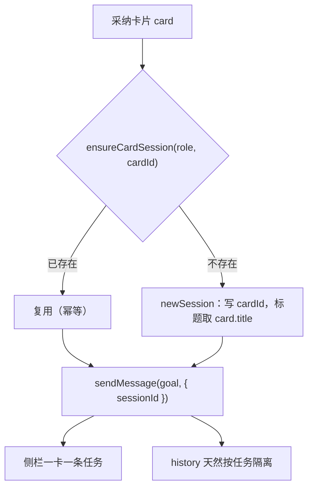

# v0.9.2 里程碑 · 简报「一卡一任务」

> 独立里程碑（不升版本号，随 v0.9.2 交付）：修复采纳路径的落点逻辑，
> 让**每张简报卡片对应工作台里的一个独立任务**。

## 背景与目标

用户反馈：**「所有采纳的简报工作都挤在一个任务里，只能滚动查找任务」**。

v0.9.2 的 P1-A「任务列表卡片化」让侧栏任务项可按内容查找，但采纳链路并未产出多条任务——
侧栏任务列表渲染的是 `chatStore.sessions`，而采纳始终写入同一个会话，列表里永远只有 1 条，
P1-A 的收益被抵消。

目标：

1. 采纳 N 张卡 → 侧栏出现 N 条任务，点击直达，不再滚动查找；
2. 同一张卡重复采纳（拖回重批后再采纳）不产生重复任务；
3. 任务间执行上下文隔离，互不干扰。

## 现状与问题

采纳有两条路径，最终都汇聚到 `chatStore.sendMessage`：

| 路径 | 位置 |
| --- | --- |
| 非专注模式：采纳即执行 | `apps/briefing/BriefingPage.tsx` → `sendMessage(goal)` |
| 专注模式：入队后台串行执行 | `stores/focusStore.ts` 泵 → `sendMessage(next.goal)` |
| 卡内链接 `kind === 'task'` | `apps/briefing/BriefingPage.tsx` → `sendMessage(link.goal)` |

而 `sendMessage` 的落点是 `ensureSession(role)`——**只要当前活跃会话角色匹配就复用**，
于是所有采纳的 goal 以 user/assistant 条目追加进同一个会话。

连带问题：

1. **上下文串味**：`runAgentTask` 的 `history` 取自整个会话的最后 8 条，
   第二张卡的任务会「看见」第一张卡的产出；
2. **标题语义差**：会话标题取 `goal.slice(0, 18)`，而非卡片标题；
3. **计数错位**：`focusStore.BackgroundTask` 一卡一条（内存态），
   与侧栏任务列表 1 条形成「后台 N 条 / 工作台 1 条」的错位；
4. **重复分叉**：拖回已盖章卡重批后再次采纳，会新增任务与条目，无幂等收敛。

## 技术方案

核心：**给 `ChatSession` 增加卡片归属 `cardId`，采纳时按卡片建/复用会话**，
而不是复用「当前活跃会话」。

| # | 改动 | 文件 |
| --- | --- | --- |
| ① | `ChatSession` 增加可选 `cardId?: string`；`newSession(role, title, cardId)` 透传并持久化 | `stores/chatStore.ts` |
| ② | 新增 `ensureCardSession(role, cardId, title, opts?)`：按 `cardId` 命中即复用，`opts.focus === false` 时建会话不抢当前焦点 | 同上 |
| ③ | `sendMessage(goal, opts?: SendMessageOptions)`：`sessionId` 显式落点优先（带存在性校验回退），支持 `cardId` / `title` | 同上 |
| ④ | `BackgroundTask` 增加 `sessionId`；`acceptTask` 入队即建/复用本卡会话（后台创建不抢焦点） | `stores/focusStore.ts` |
| ⑤ | 泵执行时携带 `sessionId` 落点，任务间互不串上下文 | 同上 |
| ⑥ | 采纳分支传 `{ cardId, title: 卡片标题 }`；卡内 `task` 链接同理 | `apps/briefing/BriefingPage.tsx` |
| ⑦ | 后台任务项可点击 → `setActive(sessionId)` 直达对应任务 | `FocusSummary.tsx`、`FocusTaskSheet.tsx` |
| ⑧ | 侧栏任务行补 `data-testid="task-item"`；E2E 断言「后台任务 N 条 ↔ 侧栏任务 N 条」 | `shell/Sidebar.tsx`、`e2e/critical-path.spec.ts` |

### 行为约定

| 场景 | 行为 |
| --- | --- |
| 采纳卡 A、B（专注模式） | 建 2 个会话（标题 = 卡片标题），后台串行执行，焦点保持不动 |
| 采纳卡 A（非专注模式） | 建会话并聚焦，跳工作台即显示该任务 |
| 拖回卡 A 重批后再次采纳 | 复用卡 A 的原会话，不新增任务 |
| 手动「新建任务」/ 对话输入 / 演示向导 | 沿用原 `ensureSession` 复用当前会话，行为不变 |
| 会话被删除后后台任务续跑 | `sendMessage` 校验 `sessionId` 不存在 → 回退 `ensureSession` 重建 |

## 任务拆解

| 任务 | 优先级 | 说明 | 涉及文件 |
| --- | --- | --- | --- |
| ① 会话归属字段 | P0 | `ChatSession.cardId` + `newSession` 透传 | `stores/chatStore.ts` |
| ② 卡片会话解析 | P0 | `ensureCardSession`（复用 / 建 / 不抢焦点） | 同上 |
| ③ 发送落点参数化 | P0 | `sendMessage(goal, opts)` | 同上 |
| ④ 后台任务绑定会话 | P0 | `BackgroundTask.sessionId` | `stores/focusStore.ts` |
| ⑤ 采纳与链接接入 | P0 | 采纳分支 + 卡内 `task` 链接 | `apps/briefing/BriefingPage.tsx` |
| ⑥ 任务直达 | P1 | 后台任务项点击直达 | `FocusSummary.tsx`、`FocusTaskSheet.tsx` |
| ⑦ 测试与 E2E | P1 | 4 条单测 + 关键路径断言 | `src/__tests__/focusStore.test.ts`、`e2e/critical-path.spec.ts` |

## 验收标准

1. 采纳 3 张卡 → 侧栏任务列表 3 条，标题为卡片标题，点击可切换；
2. 单会话内只含对应卡片的任务条目（上下文隔离，历史不再跨任务可见）；
3. 同一张卡重复采纳 → 任务数不增加；
4. 手动新建任务 / 对话输入 / 演示向导行为不变；
5. 单测 232+ 全绿、`tsc -b` 与 `vite build` 通过；
6. E2E 关键路径①通过（含「后台任务 N 条 ↔ 侧栏任务 N 条」断言）。

## 风险与对策

| 风险 | 对策 |
| --- | --- |
| 老数据无 `cardId` | 字段可选，缺省按原逻辑处理，向后兼容；`edustudio:chat` 无需迁移 |
| 后台建会话抢走用户当前焦点 | `ensureCardSession(..., { focus: false })` 建完后还原 `activeId` |
| 会话被删除但后台任务仍在执行 | `sendMessage` 对 `sessionId` 做存在性校验，失效即回退重建 |
| 无登录角色（测试环境） | `acceptTask` 中 `role` 为空时 `sessionId = null`，泵回退原 `ensureSession` 路径 |
| 包体 | 无新依赖，纯逻辑改动，增量 ≈ 0 |
